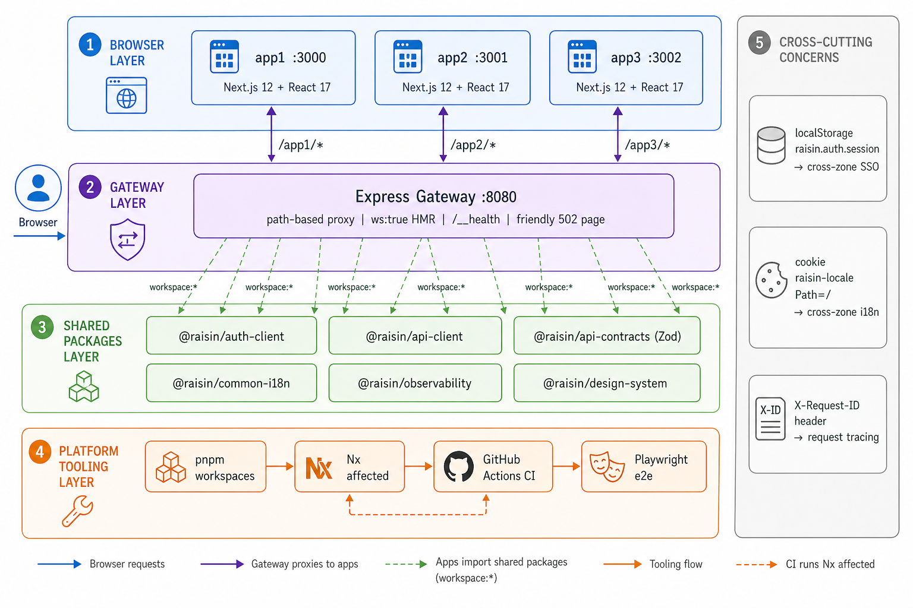

# Platform Architecture



This document is the technical reference for how the platform is structured and why. For the challenge walk-through and decision Q&A, see [solution.md](../solution.md). For specific decision records, follow the links to the [ADRs](./adr/README.md). For CI mechanics, see [ci-pipeline.md](./ci-pipeline.md).

---

## In one sentence

Three independent Next.js apps share a common platform layer and are served at a single URL through a standalone gateway — so adding a new app or a new shared capability requires no changes to existing code.

---

## Repo layout

```
apps/                          one team, one app, one port
  app1 (:3000)
  app2 (:3001)
  app3 (:3002)

packages/                      shared platform libraries
  api-contracts                Zod schemas + TypeScript types (versioned: v1, v2…)
  api-client                   auth-aware typed fetch client built on contracts
  auth-client                  token store, silent refresh, cross-tab sync
  design-tokens                framework-agnostic JSON design tokens
  design-system                React + MUI components consuming design tokens
  common-i18n                  i18next provider, global + per-app namespaces
  observability                Sentry-shaped logger, error boundary, request-ID
  navigation                   CrossAppLink with prefetch hints
  testing                      MSW handlers, renderWithProviders, fixtures
  eslint-config                shared ESLint rules (MUI guardrail + common rules)
  tsconfig                     base config presets (next / library / node)

platform/
  gateway                      Express + http-proxy-middleware proxy
  e2e                          Playwright tests against the live gateway

docs/
  adr/                         numbered, immutable Architecture Decision Records
  architecture.md              this file
  ci-pipeline.md               CI diagram and stage reference
```

---

## Principles

**Team independence.** Apps import only from `@raisin/*` shared packages — never from each other. A team owns, deploys, and iterates on their app without reading another team's code.

**Contract-first.** `@raisin/api-contracts` is the single source of truth for API shapes. The client, MSW mocks, and test fixtures all derive from it. Breaking changes require an explicit PR label to merge.

**Platform layer, not framework coupling.** Cross-cutting concerns (auth, i18n, design, observability) live in shared packages with stable contracts. Apps never import Sentry, i18next, or MUI directly — they consume the wrapper. Vendor substitution is a single-package change.

**Multi-framework readiness.** Design tokens are framework-agnostic JSON. The `api-client` and `auth-client` cores are plain TypeScript; React is a subpath import (`@raisin/auth-client/react`). An Angular `@raisin/design-system-ng` wrapping the same tokens is a packaging question, not an architectural one.

**Configuration over code.** Gateway routes, CI matrix, and environment config are data. Adding an app is a config change, not a refactor.

**Demonstrated, not theoretical.** Every shared package has at least one real consumer in `apps/` so its contract is exercised, not just declared.

---

## End-to-end request flow

Here is what happens when a user logs in on app1 and navigates to app2. This single flow exercises every shared package.

```
User → http://localhost:8080/app1/accounts
  │
  ↓ gateway
  Adds X-Request-ID, logs the access, forwards to Next.js app1 on :3000
  │
  ↓ Next.js app1 renders <AccountsPage>
  │
  ├─ AuthProvider                                        [auth-client]
  │    Reads localStorage['raisin.auth.session'] on boot
  │    → session already present → status: 'authenticated'
  │    Exposes useAuth() → { user: { email, name } }
  │
  ├─ I18nProvider                                        [common-i18n]
  │    Reads 'raisin-locale' cookie → hydrates with current locale
  │
  ├─ getApi().accounts.list()                            [api-client]
  │    ├─ refreshIfExpiring() ensures a fresh token      [auth-client]
  │    ├─ Adds Authorization: Bearer <jwt>               [auth-client]
  │    ├─ Adds X-Request-ID header                       [observability]
  │    ├─ Fetches /api/v1/accounts
  │    └─ Zod validates response against AccountListSchema  [api-contracts]
  │         → typed v1.Account[] returned
  │
  ├─ <table> renders rows with t('accounts.columns.*')   [common-i18n]
  │
  ├─ <LocaleSwitcher> writes cookie Path=/ on change     [common-i18n]
  │
  └─ <ErrorBoundary> wraps all of the above              [observability]
       → friendly fallback + structured error report on crash

User hovers "Take me to app2"
  ↓ CrossAppLink fires <link rel="prefetch"> for /app2/_app.js  [navigation]

User clicks "Take me to app2"
  ↓ Hard full-page navigation — app1 runtime is discarded
  ↓ Gateway routes /app2/* → Next.js app2 on :3001
  │
  ↓ Next.js app2 boots
    ├─ AuthProvider reads same localStorage key → already authenticated
    └─ I18nProvider reads same cookie → same locale, no reset
```

Errors at any step are handled consistently:
- **Network or HTTP failure** — `ApiError` with `requestId` attached; surfaced as a retryable UI alert and reported to observability.
- **Component crash** — `<ErrorBoundary>` shows a friendly fallback and logs the stack with PII redacted.
- **Upstream down** — gateway returns a friendly down-page naming the missing service; never a raw 502.

---

## Why each shared package exists

The table below answers the question: *what breaks if we delete this package?*

| Remove this... | ...and this happens |
|---|---|
| `api-contracts` | Server and client shapes drift independently; production reveals the disagreement. |
| `api-client` | Every app reinvents auth injection, retry-on-401, response validation, and request-ID propagation. |
| `auth-client` | Every app reinvents token storage, cross-tab sync, refresh-before-expiry, and React state. |
| `design-tokens` | Brand changes touch dozens of files; non-React consumers can't share the visual language. |
| `design-system` | Each team builds its own Button — and ships its own MUI barrel-import bundle bloat (the Task 1 bug). |
| `common-i18n` | `t()` keys differ per app; locale resets on every cross-zone navigation. |
| `observability` | Logs are unstructured strings; PII leaks into pipelines; no cross-zone correlation via request-ID. |
| `testing` | App A and app B mock the same endpoint differently; unit tests pass, integration fails. |
| `eslint-config` | Lint hygiene drifts silently; one team opts out of a rule and the class of bugs it caught returns. |
| `tsconfig` | Compiler strictness drifts; one package opts out of `strict` and a category of type errors returns. |
| `gateway` | Apps route through one "primary zone"; adding a new app requires editing and redeploying that zone. |

---

## Scaling story

### From 3 to 60 apps

The gateway is a config table. CI is `nx affected`. Cache is content-driven. A new app inherits auth, i18n, design, and observability by initialising the providers — no platform changes required.

### From React-only to multi-framework

Design tokens are already framework-agnostic. `api-client` and `auth-client` cores are plain TypeScript. Wrapping them for Angular or Vue is a subpath import addition, not an architectural change.

### From dev mocks to production

- `auth-client` mode flips from `demo` to `production` (OIDC/PKCE + BFF token exchange).
- Observability provider swaps in a real Sentry DSN.
- Gateway is replaced by a managed L7 (Nginx, Envoy, or CloudFront) speaking the same path-based contract.
- MSW disappears; real API endpoints answer instead.

---

## What comes next

- Real OIDC/PKCE flow with refresh-token rotation and a per-market BFF.
- Storybook for `@raisin/design-system` with Chromatic visual regression.
- Nx Cloud for distributed remote cache and DTE.
- OpenTelemetry traces propagated gateway → apps → backend on the existing `X-Request-ID` spine.
- `pnpm nx g @raisin/generators:new-app` — scaffold a new app, register it with the gateway, and have CI pick it up automatically.
- `@raisin/feature-flags` wrapping LaunchDarkly or Unleash.
- Angular reference app under `apps/` consuming `@raisin/design-tokens` to prove the multi-framework claim.
- Renovate + sigstore/SLSA supply-chain checks in nightly.
