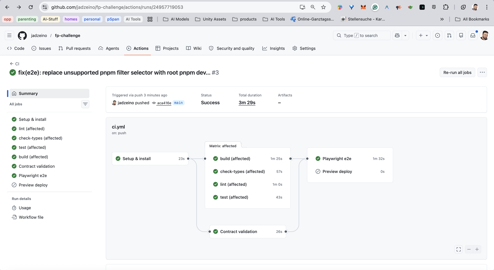
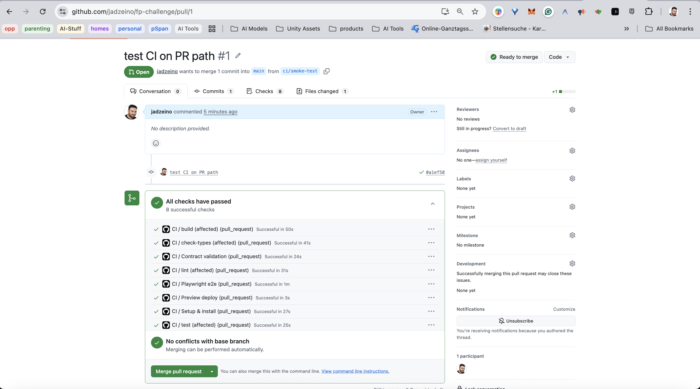
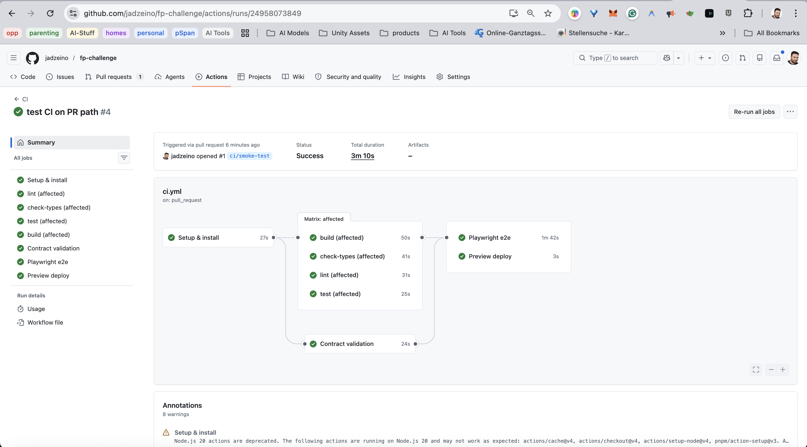

# CI Pipeline

The pipeline lives in [`.github/workflows/ci.yml`](../.github/workflows/ci.yml) with a nightly companion at [`.github/workflows/nightly.yml`](../.github/workflows/nightly.yml). The decisions behind the design are in [ADR 0005](./adr/0005-ci-strategy.md).

---

## How a change moves through CI

Every push — to a PR or to `main` — runs through five stages in order: setup → install → parallel matrix → e2e → deploy. The diagram below shows the full flow; the sections that follow explain each stage.

```mermaid
flowchart LR
  A[Push or PR] --> B[Setup\nnode@.nvmrc + pnpm cache]
  B --> C[Install\nfrozen-lockfile]
  C --> D{nx affected matrix}
  D --> E1[Lint]
  D --> E2[Typecheck]
  D --> E3[Test]
  D --> E4[Build]
  C --> F[Contracts\ntypecheck + tests + breaking-change gate]
  E1 & E2 & E3 & E4 & F --> G[Playwright e2e\ntraces on failure]
  G --> H{event?}
  H -->|PR| I[Preview deploy\nper-app ephemeral env]
  H -->|main| J[Production deploy\nper-app, gated]

  subgraph Cache
    direction TB
    K[pnpm store\nactions/setup-node]
    L[nx cache\nactions/cache by lockfile + sha]
  end
  C -. uses .-> K
  D -. uses .-> L
```

### Stage 1 — Setup

Pins Node to the version in `.nvmrc` (the same file used locally via `nvm use`) and restores the pnpm store from cache. If the cache is cold, it falls back to the previous lockfile hash and repopulates.

### Stage 2 — Install

`pnpm install --frozen-lockfile`. Fails fast if the lockfile is out of date — no silent dependency drift between environments.

### Stage 3 — nx affected matrix

Runs `lint`, `check-types`, `test`, and `build` in parallel — but **only for the packages that changed** relative to the base branch. A PR that only touches `@raisin/api-client` doesn't run the three apps or unrelated packages. This is the property that keeps CI fast as the repo grows.

### Stage 3 (parallel) — Contracts

A dedicated job that typechecks and tests `@raisin/api-contracts` independently of the matrix. Adds a gate: merging a breaking schema change requires a specific PR label. This prevents silent contract breakage reaching main while still letting teams evolve the API.

### Stage 4 — Playwright e2e

Boots the full stack via `webServer` and runs cross-zone tests — specifically the auth-session and locale-persistence flows that span multiple apps. Traces and video are retained on failure. Retries twice on CI to separate flake from real failures.

### Stage 5 — Deploy

On PRs: per-affected-app preview deploy (currently stubbed — see [production path](#production-path)).
On main: per-app production deploy, gated.

---

## Live run screenshots

Captured from [github.com/jadzeino/fp-challenge](https://github.com/jadzeino/fp-challenge/actions) — the public mirror used to validate the pipeline end-to-end.

**Push to main — all jobs green:**



**PR path — only affected packages run in the matrix:**




---

## Why it scales

| Problem | How it's solved |
|---|---|
| New apps inflate CI time | `nx affected` runs only what changed |
| Cache misses on every PR | Layered cache: pnpm store + nx computation cache, each keyed on lockfile hash with restore-key fallbacks |
| Breaking contract changes go unnoticed | Dedicated `contracts` job with a required PR label for breaking schema changes |
| Runner waste on rapid-fire pushes | `concurrency.cancel-in-progress: true` on PR runs |
| Local / CI Node version drift | `node-version-file: .nvmrc` everywhere — apps, gateway, and e2e all use the same file |
| E2e flake hides real bugs | `retries: 2` in CI; trace + video retained on every failure |

---

## PR vs. main

| Event | Matrix scope | Deploy |
|---|---|---|
| Pull request | `nx affected --base=origin/main` — only changed packages | Per-affected-app preview |
| Push to main | `nx run-many` — all projects | Per-app production (gated) |

---

## Adding a new app

1. Drop the app under `apps/<name>/`.
2. Wire the platform providers in `_app.tsx`.
3. Add one entry to `platform/gateway/src/routes.config.ts`.

That's it. CI requires **zero edits to the workflow file** — `nx affected` and the matrix pick the new app up automatically. This is the load-bearing property of the design.

---

## Nightly

Runs at 03:17 UTC and on demand:

- `pnpm audit --audit-level=high` — flags known vulnerabilities in the dependency tree.
- `license-checker` against an explicit allowlist — flags any dependency whose licence is outside the approved list.
- `pnpm -r outdated` — posts a dependency-drift report to the workflow summary.

These are **awareness tools**, not PR blockers. When something goes red it becomes a Renovate PR or a dedicated cleanup ticket.

---

## Production path

The per-PR preview-deploy job is currently a stub. The full implementation will deploy each affected app to a per-PR ephemeral environment (Vercel preview, Netlify, or a k8s namespace), fronted by an ephemeral gateway instance pointing at those previews. The path-based contract from [ADR 0002](./adr/0002-app-integration-gateway.md) makes any of those backends interchangeable — the gateway config is the only thing that changes between environments.

The next scaling upgrade is **Nx Cloud** for distributed remote cache and DTE — a one-line workflow change, worth doing once a second team is regularly opening PRs and the local nx cache is no longer sufficient.
